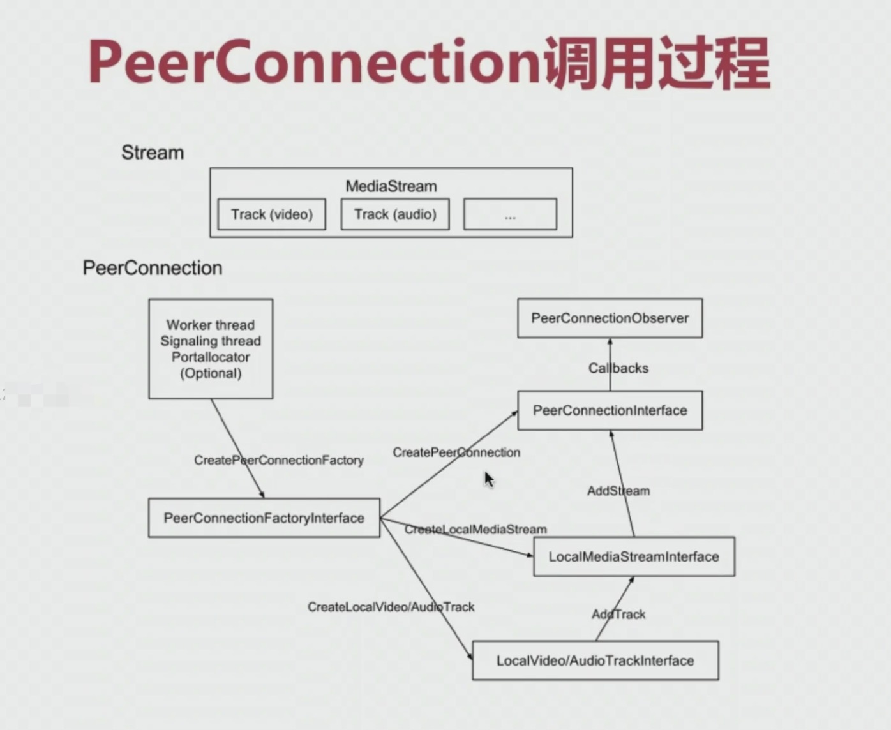
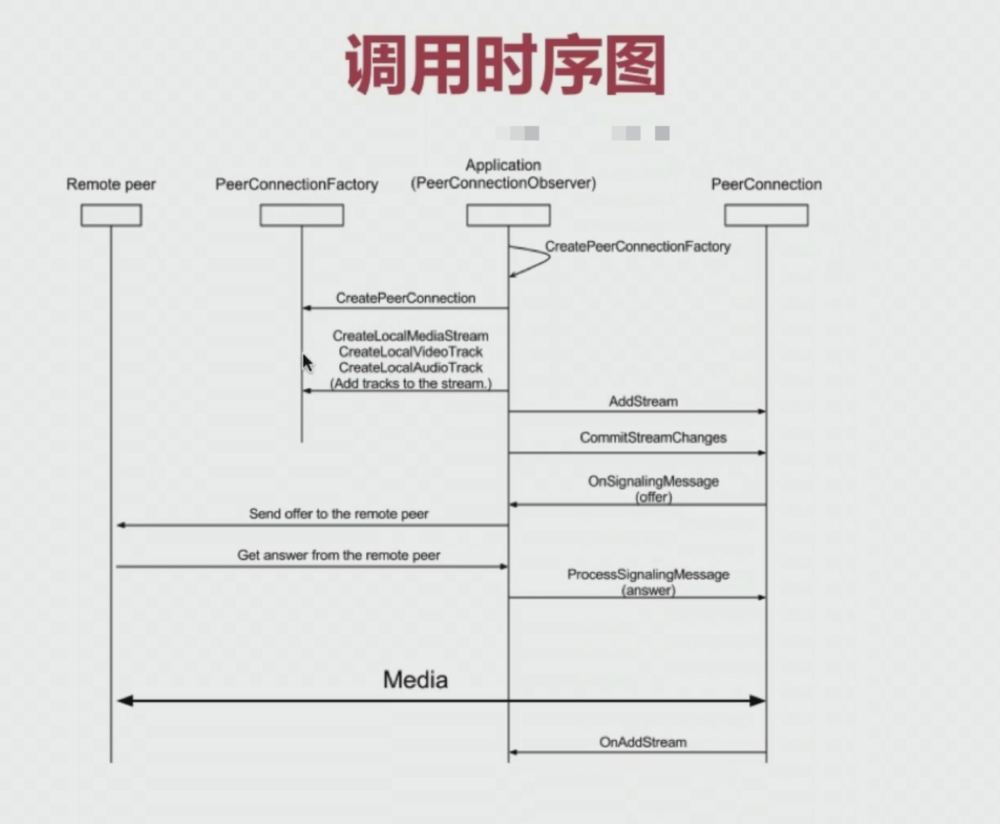
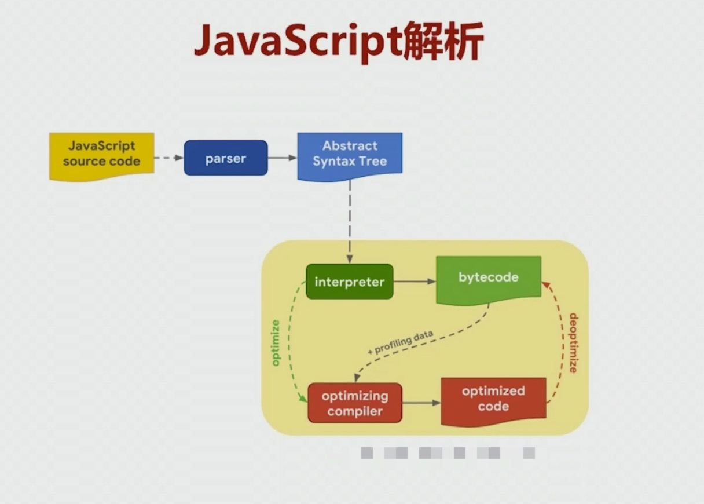
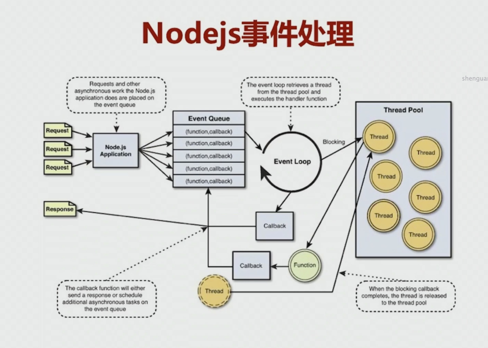
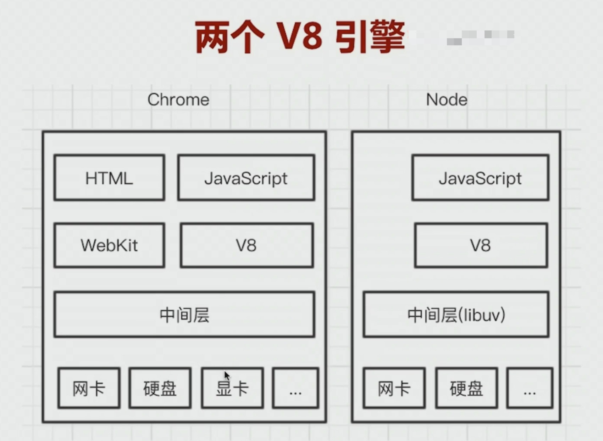

# WebRTC 基础

1. 概述

- 可以简单理解为音视频处理和即时通讯的开源库
- 2010 年有 Google 开源；
- 是一个非常优秀的多媒体框架，支持跨平台；

2. 解决什么问题？

- 音视频实时互动；
- 游戏、即时通讯、文件传输等等；
- 传输、音视频处理(回音消除，降噪等)

3. 示例网址：https://appr.tc

## 架构

## WebRTC 目录结构

1. api，WebRTC 接口层，浏览器都是通过该接口调用 WebRTC

2. call，数据流的管理层，call 代表同一个端点的所有数据的流入流出

3. video，与视频相关的逻辑

4. audio，与音频相关的逻辑

5. common_audio，音频算法相关

6. common_video，视频算法相关

7. media，与多媒体相关的逻辑处理，如：编解码的逻辑处理

8. logging，日志相关

9. module，最重要的目录，子模块

10. pc，Peer Connection 连接相关的逻辑层

11. p2p，端到端相关代码，stun 和 turn

12. rtc_base，基础代码，如：线程，锁相关的统一接口代码

13. rtc_tool，音视频分析相关的工具代码

14. tool_webrtc，WebRTC 测试相关的工具代码，如：网络模拟器

15. system_wrappers，与具体操作系统相关代码，如：CPU 特性，原子操作等等

16. stats，存放各种数据统计相关的类

17. sdk，存放 Android 和 iOS 层代码，如：视频的采集，渲染等。

## WebRTC 运行机制

1. 几个重要的类

- MediaStream：WebRTC 中重写了该类
- RTCPeerConnection：最重要的一个类，它的功能非常丰富，这样设计的好处是对应用层来说非常方便；
- RTCDataChannel：非音视频的数据都通过它进行传输；

### 轨与流

1. 轨(Track)：在多媒体中，通常指的是音频轨和视频轨

- 轨与轨之间是不相交的

2. 流(MediaStream)

### PeerConnection 调用过程

1. WebRTC 调用时序图

## web 服务器选型

### node.js

1. javascript 解析：

2. node.js 事件处理：

3. 两个 V8 引擎

4. 在类 unix 下使用 netstat 查看系统网络

5. 启动 node.js 服务

- 前台运行：node app.js

- 后台运行：nohub node app.js &

这种启动方式，它的日志打印有问题

- 借助第三方工具：forever start app.js

### https 服务

1. 为什么需要使用 HTTPS 服务？

主要是个人隐私和安全原因，在 Chrome 中，如果不启动 HTTPS 服务，调用摄像头是不允许的。

2. HTTPS = http + tls/ssl

3. 生成证书：

> 浏览器需要使用认证证书

- 私有证书：个人创建的
- 认证证书：第三方机构认证的

4. 搭建 HTTPS 服务的步骤：

- 生成 HTTPS 证书；
- 引入 HTTPS 模块
- 指定证书位置，并创建 HTTPS 服务。

### 基于 express 的 web 服务

1. 相关模块

- express
- serve-index

### nginx

### Apache
