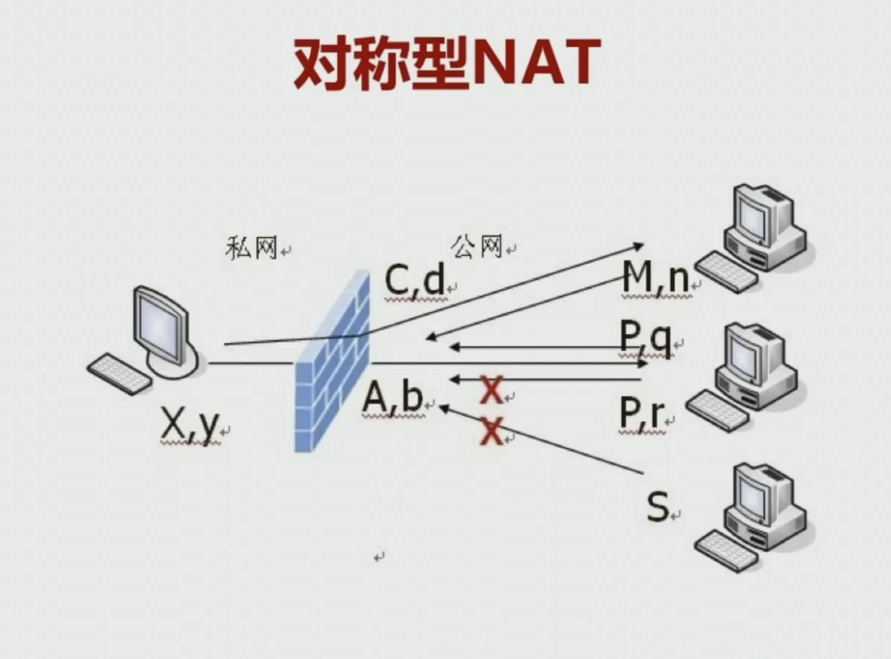

# WebRTC 传输基础

1. WebRTC 在解决什么问题？

WebRTC 首先解决的是两个浏览器之间如何进行实时音视频的互动。从底层的角度来看，就是两个端点之间如何进行高效的通信。为了这一个目标，WebRTC 引入了很多的传输协议。

## 基础知识

### NAT(Network Address Translator)

1. 示意图：

2. NAT 产生的原因

- IPv4 的地址不够；
- 出于网络安全的原因；

3. NAT 种类

- 完全锥型 NAT(Full Cone NAT);
- 地址限制锥型 NAT(Address Restricted Cone NAT);
- 端口限制型锥型 NAT(Port Restricted Cone NAT);
- 对称型 NAT(Symmetric NAT)

4. NAT 穿越

完全锥型 NAT(Full Cone NAT):

地址限制锥型 NAT:

端口限制型锥型 NAT:

对称型 NAT:

5. NAT 穿越流程

- C1, C2 向 STUN 发消息；
- 交换公网 IP 和端口；
- C1->C2, C2->C1，甚至是端口猜测(对称型 NAT)

6. NAT 穿越组合：

### STUN(Simple Traversal of UDP Through NAT)

简单理解，类似于中介，将各自的公网信息进行交换，经过信息交换之后，A 和 B 两台主机之间就可以通过 socket 通信了。

1. 作用

- STUN 存在的目的就是进行 NAT 穿越；
- STUN 是典型的 B/S 模式，客户端发送请求，服务器进行响应。

2. RFC STUN 规范

- RFC3489/STUN
- RFC5389/STUN(Session Traversal Utilities for NAT)

### TURN(Traversal Using Relays around NAT)

简单理解，就是在云端架设一台服务器，它的作用是负责不同端之间的流媒体数据转发。

在 P2P 连接不成功的情况下，作为备选路径进行通信传输。

1. 作用：

- 目的是解决对称 NAT 无法穿越的问题；

它是建立在 STUN 之上，消息格式使用 STUN 格式消息。

TURN client 要求服务端分配一个公共 IP 和 port 用于接收或发送数据。

### ICE(Interactive Connectivity Establishment)

简单来说，就是将上面的流程打包在一起，做一个最优的选择，它优先使用 P2P 连接，并作出最优的选择，当 P2P 不通的时候，会选择 TURN 服务中转。

1. 示例图

2. ice 的第一步就是将两个终端的所有的通路收集起来。

第二步是两个终端拿到对方的通路后，开始尝试打通并选择最优的通路。

3. ICE Candidate，每个 candidate 是一个地址(ip+port)，可以理解为一条通路。

拿到地址后开始交换，交换是使用 SDP，它是对媒体信息和网络信息的一种描述规范。这个规范是通过信令将耍大牌发送给对方的，两端拿到对方的 SDP，就能识别出两端都有哪些通路。

**每个候选者包括：协议、IP、端口和类型**

candidate 类型：

- 主机候选者，主机网卡的 IP 和端口；
- 反射候选者，经过 NAT 之后的 IP 和端口；
- 中继候选者，通过 TUN 服务开通的 IP 和端口。

4. ICE 的工作：

- 收集 candidate；
- 对 candidate pair 排序；
- 连通性检查。

5. 收集 candidate

- host candidate：本机所有 IP 和指定端口；
- reflexive candidate：TRUN/TURN;
- relay condition：TURN;

6. SDP(Session Description Protocol)，一种信息格式的描述标准，本身不属于传输协议，但是可以被其他传输协议交换必要的信息。

7. 形成 candidate pair

- 一方收集所有候选者后，通过信令传给对方；
- 同样，另一方收到候选者后，也做收集工作；
- 当双方拿到全部列表后，将候选者形成匹配对。

8. 连通性检查

- 对候选对进行优先级排序；
- 对每个候选队进行发送检查；
- 对每个候选队进行接收检查；

连通性过程：

## 网络协议分析

1. 工具

- Linux - tcpdump
- wireshark

### wireshark

1. 逻辑运算

- 与 - and, &&
- 或 - or, ||
- 非 - not, !

2. 判断语句：

- 等于 - eq, ==
- 小于 - lt, <
- 大于 - gt, >
- 小于等于 - le, <=
- 大于等于 - ge, >=
- 不等于 - ne, !=

3. 按协议过滤

- stun
- tcp
- udp

4. 按 IP 过滤

ip.dst==193.168.31.103
ip.src==192.168.1.1

5. 按端口过滤

tcp.port == 8080
udp.port == 3478
udp.dstport==3478
udp.srcport==3478

6. 过滤长度

udp.length<30
tcp.length<30
http.content_length<30

7. 组合过滤

- udp.srcport==3478 and ip.src==192.168.31.103
