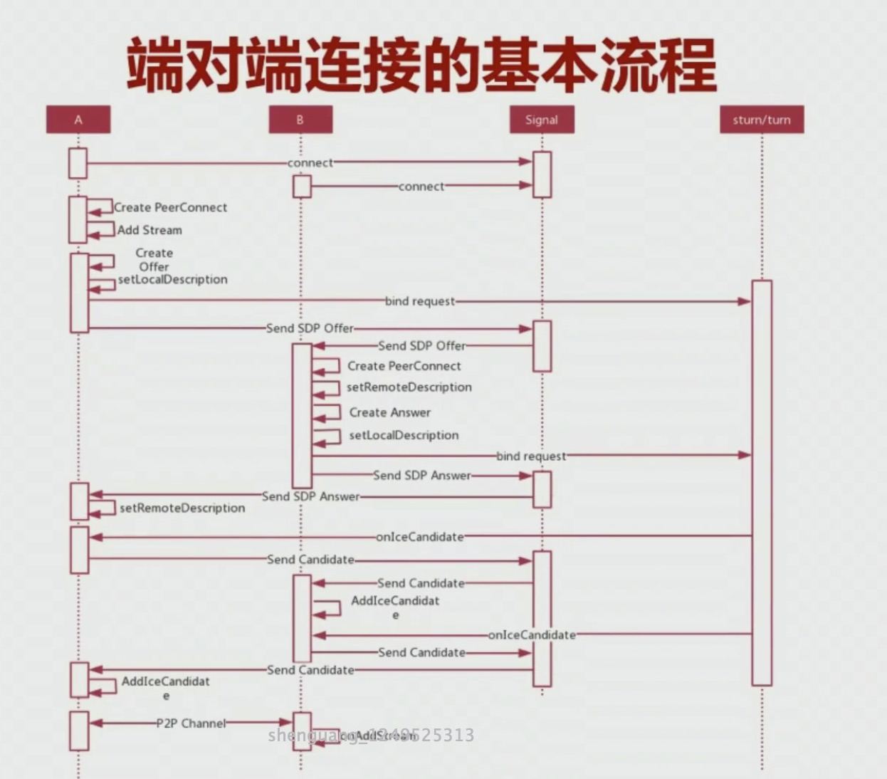
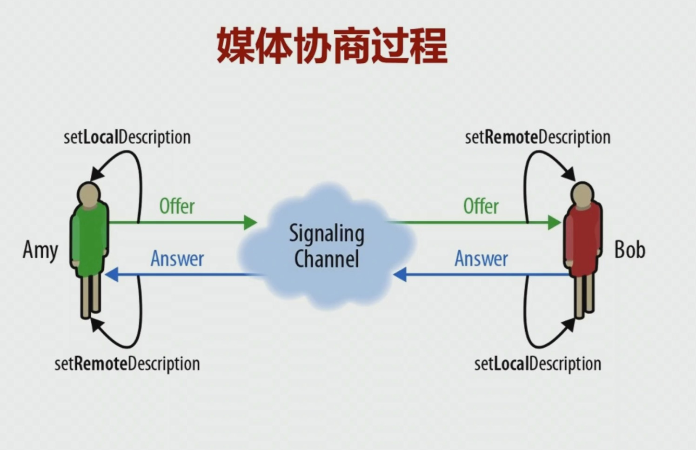

# 端对端连接

1. A 和 B 要通信，基本流程如下：

- A 和 B 媒体协商，检查各自的媒体能力，取一个交集，即两端都支持的媒体能力，如：编解码，采样率，帧率等；
- candidate 交换、连接和检测，找到两端可以连接的最优通路；
- 媒体和数据流的通信。

详细的时序图如下：



## RTCPeerConnection

1. 它是 WebRTC 的核心类，是上层的统一接口，在底层做了非常复杂的封装，包括：媒体协商，流和轨道的处理，接收和发送以及统计数据等。

2. 语法格式：

```ts
const pc = new RTCPeerConnection([configuration]);
```

### 方法

#### 媒体协商

1. 媒体协商过程



1.1 Amy

- 创建一个 Offer，创建成功之后就形成一个 SDP;
- 调用 setLocalDescription，该方法会触发收集 candidate
- 通过云端 signaling channel 传给对端；

- 收到 Bob 的 answer 之后，调用 setRemoteDescription 将相关数据存储在远程槽中。

  1.2 Bob

- 收到 Amy 传过来的 Offer 之后，调用 setRemoteDescription，将 offer 形成的 SDP 数据存储在自己的相关对象(槽)中；
- 回一个 Answer，即本身的媒体信息和网络信息；
- 调用 setLocalDescription，该方法会触发收集 candidate

tips:

- 每一端都有两个 SDP，一个是自己的媒体信息，另一个是连接端的媒体信息；

2. createOffer

语法：

```js
const offer = await myPeerConnection.createOffer([options]);
```

3. createAnswer

语法：

```js
const answer = await myPeerConnection.createAnswer([options]);
```

4. setLocalDescription

语法：

```js
const ld = await myPeerConnection.setLocalDescription(sessionDescription);
```

5. setRemoteDescription

语法：

```js
const ld = await myPeerConnection.setRemoteDescription(sessionDescription);
```

#### stream/track

1. addTrack

语法：

```js
myPeerConnection.addTrack(track, stream);
```

2. remoteTrack

语法：

```js
myPeerConnection.remoteTrack(rtpSender);
```

#### 传输相关方法

#### 统计相关方法

### 事件

1. 协商事件 - onnegotiationneeded

2. onicecandidate - 收到一个协商者时触发

## SDP(Session Description Protocol)

1. SDP 是一种信息格式的描述标准，本身不属于传输协议，但是可以被其他传输协议交换必要的信息。

2. 主要作用是用于媒体协商，在通信之前，首先进行媒体协商。

- 对于呼叫者，首先创建 offer，拿到自己的媒体信息通过信令服务器转给被呼叫者；
- 被呼叫者收到信令之后，创建 answer，拿到自己的媒体信息通过信令服务器传给呼叫者。

## 其它

1. SDP 示例

```js
const sdp = {
  type: 'offer',
  sdp: 'v=0\r\no=- 3050746827181503497 2 IN IP4 127.0.0.1\r\ns=-\r\nt=0 0\r\na=group:BUNDLE 0\r\na=extmap-allow-mixed\r\na=msid-semantic: WMS h8XNt5TUMMNVUSmUPUaUn9JsmjLwVlOpd0nn\r\nm=video 9 UDP/TLS/RTP/SAVPF 96 97 98 99 100 101 102 121 127 120 125 107 108 109 35 36 124 119 123 118 114 115 116\r\nc=IN IP4 0.0.0.0\r\na=rtcp:9 IN IP4 0.0.0.0\r\na=ice-ufrag:ol82\r\na=ice-pwd:+OcYeaJeFddX0ErPEGygwp5J\r\na=ice-options:trickle\r\na=fingerprint:sha-256 C7:14:73:77:9D:B5:64:ED:A3:11:EF:09:71:00:A5:89:9F:BA:EE:9B:4C:8D:0B:3F:8F:B2:10:D1:7B:16:92:F4\r\na=setup:actpass\r\na=mid:0\r\na=extmap:1 urn:ietf:params:rtp-hdrext:toffset\r\na=extmap:2 http://www.webrtc.org/experiments/rtp-hdrext/abs-send-time\r\na=extmap:3 urn:3gpp:video-orientation\r\na=extmap:4 http://www.ietf.org/id/draft-holmer-rmcat-transport-wide-cc-extensions-01\r\na=extmap:5 http://www.webrtc.org/experiments/rtp-hdrext/playout-delay\r\na=extmap:6 http://www.webrtc.org/experiments/rtp-hdrext/video-content-type\r\na=extmap:7 http://www.webrtc.org/experiments/rtp-hdrext/video-timing\r\na=extmap:8 http://www.webrtc.org/experiments/rtp-hdrext/color-space\r\na=extmap:9 urn:ietf:params:rtp-hdrext:sdes:mid\r\na=extmap:10 urn:ietf:params:rtp-hdrext:sdes:rtp-stream-id\r\na=extmap:11 urn:ietf:params:rtp-hdrext:sdes:repaired-rtp-stream-id\r\na=sendrecv\r\na=msid:h8XNt5TUMMNVUSmUPUaUn9JsmjLwVlOpd0nn 79ea3aab-5ea8-4a32-854d-adb7322ca0bd\r\na=rtcp-mux\r\na=rtcp-rsize\r\na=rtpmap:96 VP8/90000\r\na=rtcp-fb:96 goog-remb\r\na=rtcp-fb:96 transport-cc\r\na=rtcp-fb:96 ccm fir\r\na=rtcp-fb:96 nack\r\na=rtcp-fb:96 nack pli\r\na=rtpmap:97 rtx/90000\r\na=fmtp:97 apt=96\r\na=rtpmap:98 VP9/90000\r\na=rtcp-fb:98 goog-remb\r\na=rtcp-fb:98 transport-cc\r\na=rtcp-fb:98 ccm fir\r\na=rtcp-fb:98 nack\r\na=rtcp-fb:98 nack pli\r\na=fmtp:98 profile-id=0\r\na=rtpmap:99 rtx/90000\r\na=fmtp:99 apt=98\r\na=rtpmap:100 VP9/90000\r\na=rtcp-fb:100 goog-remb\r\na=rtcp-fb:100 transport-cc\r\na=rtcp-fb:100 ccm fir\r\na=rtcp-fb:100 nack\r\na=rtcp-fb:100 nack pli\r\na=fmtp:100 profile-id=2\r\na=rtpmap:101 rtx/90000\r\na=fmtp:101 apt=100\r\na=rtpmap:102 H264/90000\r\na=rtcp-fb:102 goog-remb\r\na=rtcp-fb:102 transport-cc\r\na=rtcp-fb:102 ccm fir\r\na=rtcp-fb:102 nack\r\na=rtcp-fb:102 nack pli\r\na=fmtp:102 level-asymmetry-allowed=1;packetization-mode=1;profile-level-id=42001f\r\na=rtpmap:121 rtx/90000\r\na=fmtp:121 apt=102\r\na=rtpmap:127 H264/90000\r\na=rtcp-fb:127 goog-remb\r\na=rtcp-fb:127 transport-cc\r\na=rtcp-fb:127 ccm fir\r\na=rtcp-fb:127 nack\r\na=rtcp-fb:127 nack pli\r\na=fmtp:127 level-asymmetry-allowed=1;packetization-mode=0;profile-level-id=42001f\r\na=rtpmap:120 rtx/90000\r\na=fmtp:120 apt=127\r\na=rtpmap:125 H264/90000\r\na=rtcp-fb:125 goog-remb\r\na=rtcp-fb:125 transport-cc\r\na=rtcp-fb:125 ccm fir\r\na=rtcp-fb:125 nack\r\na=rtcp-fb:125 nack pli\r\na=fmtp:125 level-asymmetry-allowed=1;packetization-mode=1;profile-level-id=42e01f\r\na=rtpmap:107 rtx/90000\r\na=fmtp:107 apt=125\r\na=rtpmap:108 H264/90000\r\na=rtcp-fb:108 goog-remb\r\na=rtcp-fb:108 transport-cc\r\na=rtcp-fb:108 ccm fir\r\na=rtcp-fb:108 nack\r\na=rtcp-fb:108 nack pli\r\na=fmtp:108 level-asymmetry-allowed=1;packetization-mode=0;profile-level-id=42e01f\r\na=rtpmap:109 rtx/90000\r\na=fmtp:109 apt=108\r\na=rtpmap:35 AV1X/90000\r\na=rtcp-fb:35 goog-remb\r\na=rtcp-fb:35 transport-cc\r\na=rtcp-fb:35 ccm fir\r\na=rtcp-fb:35 nack\r\na=rtcp-fb:35 nack pli\r\na=rtpmap:36 rtx/90000\r\na=fmtp:36 apt=35\r\na=rtpmap:124 H264/90000\r\na=rtcp-fb:124 goog-remb\r\na=rtcp-fb:124 transport-cc\r\na=rtcp-fb:124 ccm fir\r\na=rtcp-fb:124 nack\r\na=rtcp-fb:124 nack pli\r\na=fmtp:124 level-asymmetry-allowed=1;packetization-mode=1;profile-level-id=4d0032\r\na=rtpmap:119 rtx/90000\r\na=fmtp:119 apt=124\r\na=rtpmap:123 H264/90000\r\na=rtcp-fb:123 goog-remb\r\na=rtcp-fb:123 transport-cc\r\na=rtcp-fb:123 ccm fir\r\na=rtcp-fb:123 nack\r\na=rtcp-fb:123 nack pli\r\na=fmtp:123 level-asymmetry-allowed=1;packetization-mode=1;profile-level-id=640032\r\na=rtpmap:118 rtx/90000\r\na=fmtp:118 apt=123\r\na=rtpmap:114 red/90000\r\na=rtpmap:115 rtx/90000\r\na=fmtp:115 apt=114\r\na=rtpmap:116 ulpfec/90000\r\na=ssrc-group:FID 3581956432 645893509\r\na=ssrc:3581956432 cname:iFpbI0x8lrKHvy+y\r\na=ssrc:3581956432 msid:h8XNt5TUMMNVUSmUPUaUn9JsmjLwVlOpd0nn 79ea3aab-5ea8-4a32-854d-adb7322ca0bd\r\na=ssrc:3581956432 mslabel:h8XNt5TUMMNVUSmUPUaUn9JsmjLwVlOpd0nn\r\na=ssrc:3581956432 label:79ea3aab-5ea8-4a32-854d-adb7322ca0bd\r\na=ssrc:645893509 cname:iFpbI0x8lrKHvy+y\r\na=ssrc:645893509 msid:h8XNt5TUMMNVUSmUPUaUn9JsmjLwVlOpd0nn 79ea3aab-5ea8-4a32-854d-adb7322ca0bd\r\na=ssrc:645893509 mslabel:h8XNt5TUMMNVUSmUPUaUn9JsmjLwVlOpd0nn\r\na=ssrc:645893509 label:79ea3aab-5ea8-4a32-854d-adb7322ca0bd\r\n',
};
```
