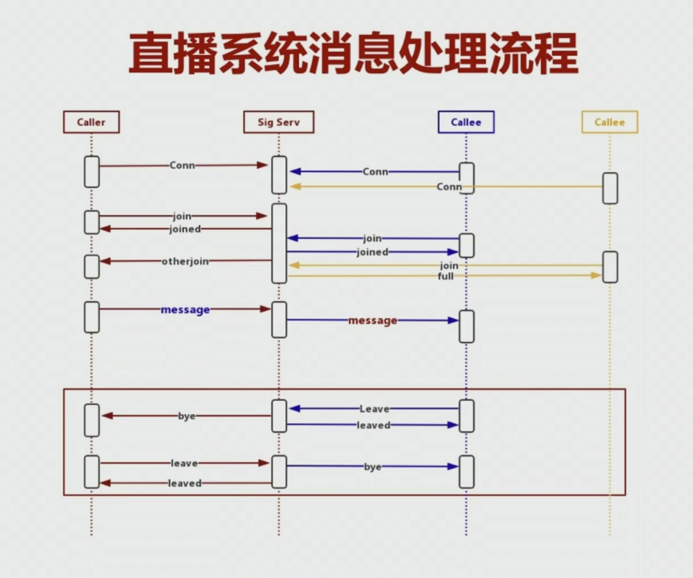

# 搭建 STUN/TURN 服务器

1. STUN/TURN 服务器选型

- rfc5766-turn-sever
- coTurn，推荐使用
- ResTurn

2. coTurn 服务器搭建与部署

> [github](https://github.com/coturn/coturn) > [github/docker](https://github.com/coturn/coturn/tree/master/docker/coturn)

步骤(Linux/Mac)：

- 下载 coTurn;
- ./configure --prefix=/usr/local/coturn;
- 编译 make && make install.

tips:

> ECS 指的是 Ubuntu

- 配置文件位置：/usr/local/coturn

## coTurn

1. 服务器配置

- listening-port=3478 - 指定侦听的端口；
- external-ip=x.x.x.x - 指定云主机的公网 IP；
- user=aaa:bbb - 访问 stun/turn 服务的用户名和密码；
- realm=turn.xxx.cn - 域名，一定要设置

## RTCPeerConnection

1. 语法格式：

```js
const peer = new RTCPeerConnection([configuration]);
```

2. configuration

- 最重要的是 iceServers

```ts
interface RTCConfiguration {
  bundlePolicy?: RTCBundlePolicy;
  certificates?: RTCCertificate[];
  iceCandidatePoolSize?: number;
  iceServers?: RTCIceServer[];
  iceTransportPolicy?: RTCIceTransportPolicy;
  rtcpMuxPolicy?: RTCRtcpMuxPolicy;
}

interface RTCIceServer {
  credential?: string;
  credentialType?: RTCIceCredentialType;
  urls: string | string[];
  username?: string;
}

type RTCBundlePolicy = 'balanced' | 'max-bundle' | 'max-compat';
type RTCIceCredentialType = 'password';
type RTCIceTransportPolicy = 'all' | 'relay';
type RTCRtcpMuxPolicy = 'require';
```

bundlePolicy：

- balanced - 音频和视频轨使用各自的传输通道；
- max-bundle - 都绑定到同一个传输通道；
- max-compat - 每个轨道使用自己的传输通道。

certificates：授权可以使用连接的一组证书，一般需要设置。

iceCandidatePoolSize：16 位的整数值，用于指定预取的 ice 候选者的个数，如果该值发生变化，它会触发重新收集候选者。

iceTransportPolicy，指定 ICE 传输策略：

- relay - 只使用中继候选者；
- all - 可以使用任何类型的候选者；

iceServers，由 RTCIceServer 组成，每个 RTCIceServer 都是一个 ICE 代理的服务：

- credential：凭据，只有 turn 服务使用；
- credentialType：凭据类型可以是 password 或 oauth（ps: 在 vue-next 只看到 password）
- urls：用于连接服务中的 url 数组；
- username：用户名，只有 turn 服务使用

rtcpMuxPolicy，在收集 ice 候选者时使用：

- negotiate - 收集 RTCP 与 RTP 复用的 ICE 候选者，如果 RTCP 能复用就与 RTP 复用，如果不能复用，就将它们单独使用；
- require - 只能收集 RTCP 与 RTP 复用的 ICE 候选者，如果 RTCP 不能复用，则失败。

### addIceCandidate

1. 语法

```js
const res = await pc.addIceCandidate(candidate);
```

## 1V1 音视频实时互动

1. 客户端信令消息

- join - 加入房间；
- leave - 离开房间；
- message - 端到端消息。

2. 端到端信令消息

- offer 消息；
- answer 消息；
- candidate 消息。

3. 服务端信令消息

- joined - 已加入房间；
- otherJoin - 其它用户加入房间；
- full - 房间人数已满
- leaved - 已离开房间；
- bye - 对方离开房间；

3. 音视频通信的核心之一是信令的交互的关系，只有梳理清楚了信令的交互逻辑关系，才能把握整个程序的运行。

直播系统消息处理流程：



## createOffer

1. 语法

```ts
const res = await pc.createOffer([options]);

interface RTCOfferOptions extends RTCOfferAnswerOptions {
  iceRestart?: boolean;
  offerToReceiveAudio?: boolean;
  offerToReceiveVideo?: boolean;
}
```

options:

> 说明：类型说明取自 vscode 的插件 vetur-0.35.0 下的 typescript 的 lib.dom.d.ts

- iceRestart - 重启 ice，重新进行 candidate 收集；
- voiceActivityDetection - 是否开启静音检测，默认开启。
